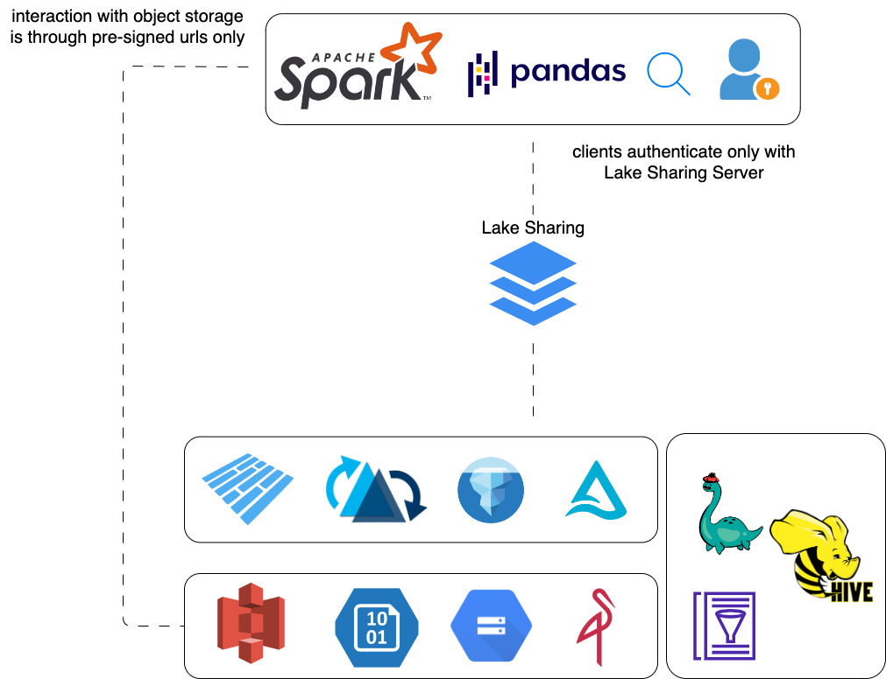

# Lake Sharing

Lake Sharing is an open protocol, heavily influenced by Delta Sharing, for secure exchange of large datasets, which enables organizations to share data regardless of which computing platforms and table/file format they use.

This repo includes the following components:

- Lake Sharing protocol specifications
  - Data sharing protocol specification
  - Admin protocol specification
- Lake Sharing Server
- Apache Spark Connector
- Python Connector

## Motivation

1. Delta-Sharing is limited to Delta Lake tables, Lake Sharing aims to allow consumption of any table format or file format (i.e. also plain Parquet and CSV tables).
2. Delta-Sharing does not cover the admin plane creation of shares, users, groups and grants is not part of the protocol, we aim to cover it

## Roadmap

1. overall architecture
2. protocol specification
3. end to end use case: Batch, Iceberg + Hive, S3, Spark
4. support to Delta Lake
5. support to time travel
6. support to plain tables